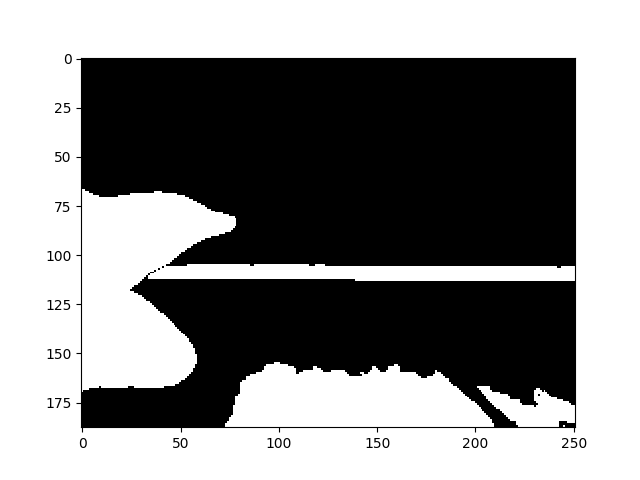
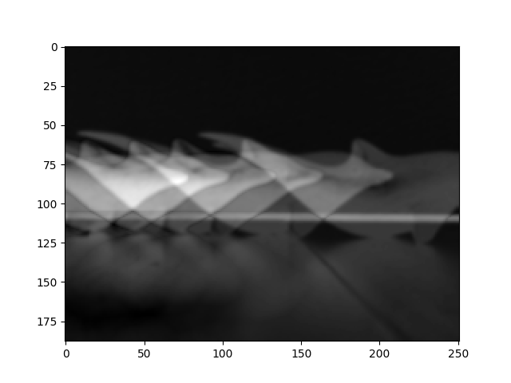

# Difference Image Generator

## What it does

Generates a difference image, used in computer vision contexts to look for motion or changes in illumination.
Can create both a regular difference image (between 2 images), and a cumulative difference image (over many images).

## Example Images

Simple Difference:

Cumulative Difference:

